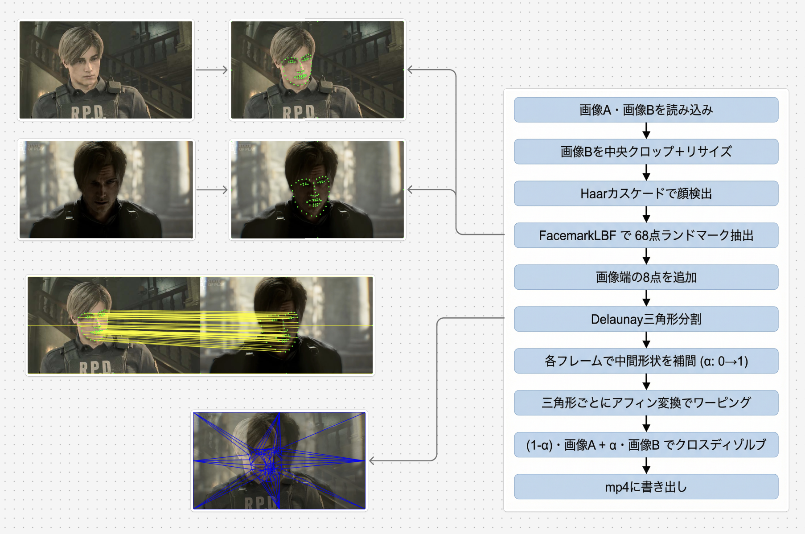

画像情報処理のレポート課題で作ったプログラムです

## システムの概要

Python と OpenCV を用いて、2枚の顔画像間のモーフィング動画（MP4）を自動生成するツール

## 使用ライブラリ

| ライブラリ | 用途                                                                                                          |
| ---------- | ------------------------------------------------------------------------------------------------------------- |
| OpenCV     | 顔検出（Haarカスケード）、68点ランドマーク抽出（FacemarkLBF）、Delaunay三角形分割、アフィン変換、動画書き出し |
| NumPy      | 座標計算、画素の補間合成                                                                                      |

## 処理内容

1. **画像の読み込みとサイズ合わせ**
   2枚目を1枚目と同じ解像度に合わせる。アスペクト比が異なる場合は中央をクロップしてからリサイズする。
2. **顔検出**
   OpenCVのHaarカスケード（正面顔＋横顔）で各画像から顔の矩形を検出する。
3. **68点ランドマーク抽出**
   `cv2.face.FacemarkLBF`（学習済みモデル `lbfmodel.yaml`）を使い、検出した顔矩形に対して目・鼻・口・輪郭の68点を自動取得する。
4. **Delaunay三角形分割**
   2枚の68点の中間座標でDelaunay三角形分割を作る。画像端の8点も追加して、画像全体をカバーする。
5. **フレーム生成（ワーピング＋クロスディゾルブ）**
   各フレームで補間率 α（0→1）に応じて中間形状を計算し、画像1と画像2をそれぞれ中間形状へアフィン変換でワープ。2つのワープ結果を (1-α) と α で加算合成して1フレームとする。
6. **MP4出力**
   全フレームをMP4に書き出す。
